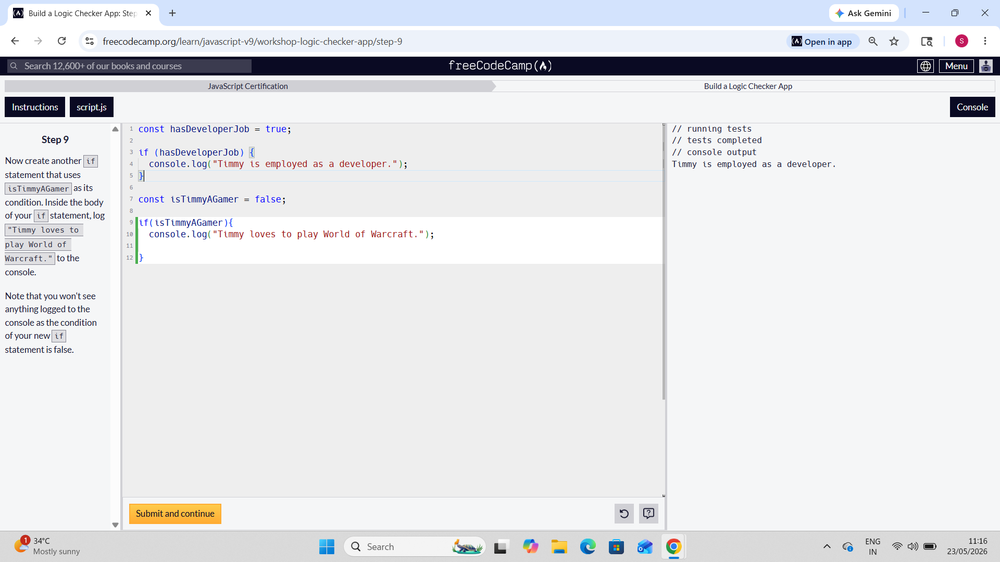

# FreeCodeCamp Responsive Web Design & HTML-CSS-javaScript Workshop 🚀

Welcome to my repository! This space is dedicated to tracking my progress, daily labs, and workshops as I complete the **Responsive Web Design Certification** on FreeCodeCamp.

## 📚 What I am Learning
* Semantic HTML5 elements for clean web structure.
* CSS3 styling, layouts, and responsive designs.
* Building clean, professional user interfaces.

## 📂 Project Showcase
* **Travelagency:** A practice workshop file focusing on structural layout and web styling.

* **audio and video player:** A practice task learning how to embed media elements using HTML.
* **SVG Icon:**   A frontend micro-task exploring scalable vector graphics, custom path design, and rendering clean geometric shapes directly using Html code
* **JS INC-DEC operator:** Debug increment and decrement operator errors in a buggy app  
* **JS Build a logic Checker app:** A practical workshop exploring conditional control structures and comparision operators to evaluate truthy/falsy and manage console output logic

*  (conditioncheckoutput.png)
### MathBot Terminal Output:
```text
*    Hi there! My name is MathBot and I am here to teach you about the Math object!
The Math.random() method returns a pseudo random number greater than or equal to 0 and less than 1.
0.34181656476994016
Now, generate a random number between two values.
20.399516914213592
The Math.floor() method rounds the value down to the nearest whole integer.
6
Now, generate a random integer between two values.
68
The Math.ceil() method rounds the value up to the nearest whole integer.
4
The Math.round() method rounds the value to the nearest whole integer.
3
11
The Math.max() and Math.min() methods are used to get the maximum and minimum number from a range.
125
2
It was fun learning about the different Math methods with you!
```
* **fortune-teller.js:** A dynamic text-based simulation utilizing mathematical scaling functions (`Math.random`) and strict conditional logic execution pathways to evaluate state and deliver randomly selected algorithmic predictions
* **video-player using iframe.html** An embedded media player application utilizing secure document sandboxing (`i frame` architectures) and cross-origin embedding standards to stream external digital content dynamically.
* **Video-compilation Page** A responsive video dashboard that organizes and plays a curated collection of videos using a multimedia grid.
* **Description List/terms/definition:** A semantic HTML page structuring content terms and definitions cleanly using description list elements.
* **Blackquote.html:** A semantic HTML structure utilizing blockquote elements to cleanly format and present quoted text.
 * **function Calculator.js**  A JavaScript file with math functions (add, subtract, multiply, divide,exponent,sqrt()). It includes a safety check to stop division by zero errors.
 *  **Boolean- logic-check.js** A script implementing conditional state evaluation and strict boolean truthy/falsy checks for application logic flow.
 *  * **email-masker.js:** A data privacy utility that implements string manipulation and formatting algorithms to securely mask sensitive user email addresses.
* **cat-blog-page.html:** A responsive web application layout featuring multi-column media components, structural content grids, and fluid layout typography rules.
* * **event-hub.html:** An event management landing page layout structured with semantic markup, anchor-linked multi-item navigation, and responsive content sections.
_____________ _ _ _ _ _ _ _ _ _ _ _ _ _ _ _ _ _ __ __ _ _ _ _ _ _ _ _ _ _ _ _ _ _ _ _ _ _ _
*Learning daily, building consistently, and pushing my code to track my development journey!*
